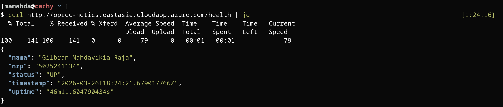
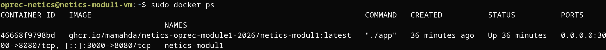
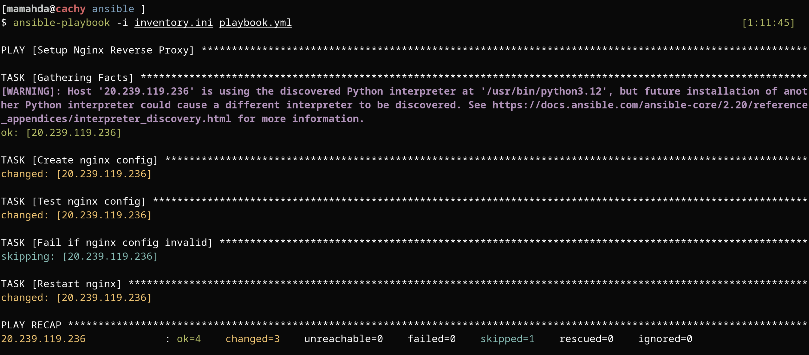
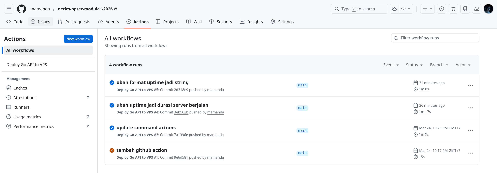

# Laporan Modul 1 OPREC NETICS

**Nama:** Gilbran Mahdavikia Raja  
**NRP:** 5025241134  
**VPS:** Azure (IP: `20.239.119.236`, Domain: `http://oprec-netics.eastasia.cloudapp.azure.com`)

---

## Daftar Isi

1. [Gambaran Umum](#1-gambaran-umum)
2. [Arsitektur Sistem](#2-arsitektur-sistem)
3. [API Server (Go)](#3-api-server-go)
4. [Containerisasi dengan Docker](#4-containerisasi-dengan-docker)
5. [Konfigurasi Ansible](#5-konfigurasi-ansible)
6. [Pipeline CI/CD dengan GitHub Actions](#6-pipeline-cicd-dengan-github-actions)
7. [Best Practices yang Diterapkan](#7-best-practices-yang-diterapkan)
8. [Cara Menjalankan](#8-cara-menjalankan)
9. [Hasil Akhir](#9-hasil-akhir)
10. [Lampiran](#10-lampiran)

---

## 1. Gambaran Umum

Proyek ini mengimplementasikan modul CI/CD lengkap yang terdiri dari:

- **API publik** berbasis Go yang mengekspos endpoint `/health`
- **Containerisasi** menggunakan Docker dengan multi-stage build
- **Reverse proxy** Nginx yang dikonfigurasi otomatis menggunakan Ansible
- **Pipeline CI/CD** menggunakan GitHub Actions untuk otomasi build, push image, dan deploy ke VPS Azure

---

## 2. Arsitektur Sistem

```
Developer → Push ke GitHub (branch: main)
                    ↓
           GitHub Actions Workflow
                    ↓
     ┌──────────────────────────────┐
     │  Job 1: build-and-push       │
     │  - Build Docker image        │
     │  - Push ke GHCR              │
     └──────────────┬───────────────┘
                    ↓
     ┌──────────────────────────────┐
     │  Job 2: deploy               │
     │  - SSH ke VPS Azure          │
     │  - Pull image dari GHCR      │
     │  - Jalankan container baru   │
     └──────────────────────────────┘
                    ↓
         VPS Azure (20.239.119.236)
         ┌──────────────────────┐
         │  Nginx (port 80)     │  ← reverse proxy
         │       ↓              │
         │  Container Go API    │
         │  (port 3000→8080)    │
         └──────────────────────┘
                    ↓
         Client → GET /health
```

---

## 3. API Server (Go)

### Deskripsi

API ditulis menggunakan bahasa Go dengan library standar (`net/http`). Server mendengarkan pada port **8080** di dalam container dan mengekspos satu endpoint: `/health`.

### Source Code

**`main.go`**

```go
package main

import (
    "encoding/json"
    "net/http"
    "time"
)

func main() {
    serverTime := time.Now()

    http.HandleFunc("/health", func(w http.ResponseWriter, r *http.Request) {
        // CORS - hanya izinkan metode GET
        w.Header().Set("Access-Control-Allow-Origin", "*")
        w.Header().Set("Access-Control-Allow-Methods", "GET")

        if r.Method != http.MethodGet {
            http.Error(w, "Method not allowed", http.StatusMethodNotAllowed)
            return
        }

        currentTime := time.Now()
        upTime := time.Since(serverTime)

        response := map[string]interface{}{
            "nama":      "Gilbran Mahdavikia Raja",
            "nrp":       "5025241134",
            "status":    "UP",
            "timestamp": currentTime,
            "uptime":    upTime.String(),
        }

        w.Header().Set("Content-Type", "application/json")
        w.WriteHeader(http.StatusOK)
        json.NewEncoder(w).Encode(response)
    })

    http.ListenAndServe(":8080", nil)
}
```

### Contoh Respons Endpoint `/health`

```json
{
  "nama": "Gilbran Mahdavikia Raja",
  "nrp": "5025241134",
  "status": "UP",
  "timestamp": "2026-03-26T18:24:21.679017766Z",
  "uptime": "46m11.604790434s"
}
```

### Penjelasan Field

| Field       | Tipe   | Keterangan                                              |
| ----------- | ------ | ------------------------------------------------------- |
| `nama`      | string | Nama peserta                                            |
| `nrp`       | string | Nomor Registrasi Pokok peserta                          |
| `status`    | string | Status server, selalu `"UP"` selama server berjalan     |
| `timestamp` | time   | Waktu saat request diterima                             |
| `uptime`    | string | Durasi server telah berjalan sejak pertama kali distart |

---

## 4. Containerisasi dengan Docker

### Dockerfile

Menggunakan **multi-stage build** untuk menghasilkan image yang ringan dan aman.

```dockerfile
# Stage 1: Builder — kompilasi binary Go
FROM golang:1.25-alpine AS builder

RUN apk add --no-cache git

WORKDIR /app

COPY go.mod go.sum* ./
RUN go mod download

COPY . .

RUN CGO_ENABLED=0 GOOS=linux go build -ldflags="-s -w" -o app .

# Stage 2: Runtime — image minimalis tanpa toolchain Go
FROM alpine:3.19

RUN adduser -D appuser
USER appuser

WORKDIR /app

COPY --from=builder /app/app .

EXPOSE 8080

ENTRYPOINT ["./app"]
```

### Penjelasan Dockerfile

**Stage 1 (Builder):**

- Menggunakan `golang:1.25-alpine` sebagai base image untuk kompilasi
- Flag `-ldflags="-s -w"` menghapus debug symbols untuk mengecilkan ukuran binary
- `CGO_ENABLED=0` memastikan binary bersifat statically linked (tidak bergantung pada library C)

**Stage 2 (Runtime):**

- Menggunakan `alpine:3.19` yang sangat ringan
- Membuat user `appuser` non-root untuk keamanan — container tidak berjalan sebagai root
- Hanya menyalin binary hasil kompilasi, tidak ada source code di image final

### Struktur Direktori

```
.
└── src/
    └── app/
        ├── main.go
        ├── go.mod
        └── Dockerfile
```

---

## 5. Konfigurasi Ansible

Ansible digunakan untuk mengotomasi instalasi dan konfigurasi Nginx sebagai reverse proxy di VPS, tanpa perlu konfigurasi manual.

### Inventory

**`inventory.ini`**

```ini
[web]
20.239.119.236 ansible_user=oprec-netics ansible_ssh_private_key_file=~/.ssh/id_ed25519
```

| Parameter                      | Nilai               | Keterangan                             |
| ------------------------------ | ------------------- | -------------------------------------- |
| Host                           | `20.239.119.236`    | IP publik VPS Azure                    |
| `ansible_user`                 | `oprec-netics`      | Username SSH di VPS                    |
| `ansible_ssh_private_key_file` | `~/.ssh/id_ed25519` | Path private key untuk autentikasi SSH |

### Playbook

**`playbook.yml`**

```yaml
- name: Setup Nginx Reverse Proxy
  hosts: web
  become: yes

  tasks:
    - name: Create nginx config
      copy:
        dest: /etc/nginx/sites-available/default
        content: |
          server {
              listen 80;
              server_name _;

              location / {
                  proxy_pass http://127.0.0.1:3000/;
              }
          }

    - name: Test nginx config
      command: nginx -t
      register: nginx_test
      ignore_errors: yes

    - name: Fail if nginx config invalid
      fail:
        msg: "Nginx config invalid!"
      when: nginx_test.rc != 0

    - name: Restart nginx
      service:
        name: nginx
        state: restarted
```

### Alur Kerja Playbook

```
1. Tulis konfigurasi Nginx → /etc/nginx/sites-available/default
         ↓
2. Jalankan `nginx -t` untuk validasi konfigurasi
         ↓
3. Jika konfigurasi tidak valid → playbook GAGAL (mencegah nginx down)
         ↓
4. Jika valid → Restart service Nginx
         ↓
5. Nginx siap meneruskan request dari port 80 ke port 3000 (container)
```

### Cara Menjalankan Playbook

```bash
ansible-playbook -i inventory.ini playbook.yml
```

Setelah playbook berhasil dijalankan, Nginx akan secara otomatis meneruskan semua request yang masuk ke port 80 menuju container API yang berjalan di port 3000, tanpa konfigurasi manual apapun.

---

## 6. Pipeline CI/CD dengan GitHub Actions

### Workflow File

**`.github/workflows/deploy.yml`**

```yaml
name: Deploy Go API to VPS

on:
  push:
    branches:
      - main

jobs:
  build-and-push:
    runs-on: ubuntu-latest
    permissions:
      contents: read
      packages: write

    steps:
      - name: Checkout repository
        uses: actions/checkout@v4

      - name: Log in to GitHub Container Registry (GHCR)
        uses: docker/login-action@v3
        with:
          registry: ghcr.io
          username: ${{ github.actor }}
          password: ${{ secrets.GITHUB_TOKEN }}

      - name: Build and push Docker image
        uses: docker/build-push-action@v5
        with:
          context: ./src/app
          push: true
          tags: |
            ghcr.io/${{ github.repository }}/netics-modul1:latest
            ghcr.io/${{ github.repository }}/netics-modul1:${{ github.sha }}

  deploy:
    needs: build-and-push
    runs-on: ubuntu-latest
    steps:
      - name: Execute deployment on VPS via SSH
        uses: appleboy/ssh-action@v1.0.3
        with:
          host: ${{ secrets.VPS_HOST }}
          username: ${{ secrets.VPS_USERNAME }}
          key: ${{ secrets.VPS_SSH_KEY }}
          script: |
            # Login ke GHCR di VPS
            echo "${{ secrets.GHCR_PAT }}" | sudo docker login ghcr.io -u ${{ github.actor }} --password-stdin

            sudo docker pull ghcr.io/${{ github.repository }}/netics-modul1:latest

            sudo docker stop netics-modul1 || true
            sudo docker rm netics-modul1 || true

            sudo docker run -d \
              --name netics-modul1 \
              -p 3000:8080 \
              ghcr.io/${{ github.repository }}/netics-modul1:latest

            sudo docker image prune -f
```

### Penjelasan Alur Workflow

#### Trigger

Workflow dijalankan secara otomatis setiap kali ada `push` ke branch `main`.

#### Job 1: `build-and-push`

| Step                          | Aksi                                               |
| ----------------------------- | -------------------------------------------------- |
| `actions/checkout@v4`         | Clone repository ke runner                         |
| `docker/login-action@v3`      | Login ke GHCR menggunakan `GITHUB_TOKEN` otomatis  |
| `docker/build-push-action@v5` | Build Docker image dan push ke GHCR dengan dua tag |

**Dua tag yang digunakan:**

- `:latest` — selalu menunjuk ke image terbaru
- `:<git-sha>` — tag unik per commit, memungkinkan rollback ke versi spesifik

#### Job 2: `deploy`

Job ini hanya berjalan setelah `build-and-push` berhasil (`needs: build-and-push`).

| Step                        | Aksi                                                                               |
| --------------------------- | ---------------------------------------------------------------------------------- |
| Login GHCR di VPS           | Autentikasi menggunakan `GHCR_PAT`                                                 |
| `docker pull`               | Unduh image terbaru dari GHCR                                                      |
| `docker stop` + `docker rm` | Hentikan dan hapus container lama (`true` mencegah error jika container tidak ada) |
| `docker run`                | Jalankan container baru dengan port mapping `3000:8080`                            |
| `docker image prune`        | Bersihkan image lama yang tidak digunakan                                          |

### GitHub Secrets yang Diperlukan

Secrets dikonfigurasi di **Settings → Secrets and variables → Actions** pada repositori GitHub.

| Secret         | Keterangan                                                                        |
| -------------- | --------------------------------------------------------------------------------- |
| `VPS_HOST`     | IP publik VPS Azure (`20.239.119.236`)                                            |
| `VPS_USERNAME` | Username SSH di VPS (`oprec-netics`)                                              |
| `VPS_SSH_KEY`  | Isi private key SSH (contoh: konten `~/.ssh/id_ed25519`)                          |
| `GHCR_PAT`     | GitHub Personal Access Token dengan scope `read:packages` untuk login GHCR di VPS |

> **Catatan:** `GITHUB_TOKEN` tidak perlu didefinisikan secara manual — GitHub menyediakannya secara otomatis untuk setiap workflow run.

---

## 7. Best Practices yang Diterapkan

### Keamanan

| Praktik                           | Implementasi                                                                |
| --------------------------------- | --------------------------------------------------------------------------- |
| **Tidak ada credential hardcode** | Semua secret (SSH key, PAT, IP VPS) disimpan di GitHub Secrets              |
| **Container non-root**            | Dockerfile membuat `appuser` dan menjalankan aplikasi sebagai user tersebut |
| **Multi-stage build**             | Source code dan toolchain Go tidak ikut terbawa ke image produksi           |
| **Minimal attack surface**        | Image runtime menggunakan `alpine:3.19` yang sangat kecil                   |

### Reliabilitas

| Praktik                      | Implementasi                                                                                                          |
| ---------------------------- | --------------------------------------------------------------------------------------------------------------------- |
| **Validasi sebelum apply**   | Playbook Ansible menjalankan `nginx -t` sebelum restart — jika config salah, playbook gagal dan Nginx tidak terganggu |
| **Zero-downtime deployment** | Container lama dihentikan hanya setelah image baru berhasil di-pull                                                   |
| **Graceful error handling**  | `true` pada `docker stop/rm` mencegah kegagalan workflow jika container belum ada                                     |
| **Job dependency**           | Job `deploy` hanya berjalan jika `build-and-push` sukses                                                              |

### Maintainability

| Praktik                    | Implementasi                                                                     |
| -------------------------- | -------------------------------------------------------------------------------- |
| **Versioned image tags**   | Setiap image di-tag dengan Git SHA, memungkinkan audit dan rollback              |
| **Image cleanup**          | `docker image prune -f` membersihkan image lama otomatis setelah deploy          |
| **Pinned Action versions** | Menggunakan versi spesifik (`@v4`, `@v3`) bukan `@latest` untuk reprodusibilitas |
| **CORS restriction**       | API hanya mengizinkan metode GET pada endpoint `/health`                         |

---

## 8. Cara Menjalankan

### Prasyarat

- VPS Azure dengan Nginx terinstal dan dapat diakses via SSH
- Docker terinstal di VPS
- Ansible terinstal di mesin lokal
- SSH key yang sudah dikonfigurasi untuk akses ke VPS

### Langkah 1: Setup Nginx via Ansible

Jalankan perintah berikut dari direktori root repositori:

```bash
ansible-playbook -i inventory.ini playbook.yml
```

### Langkah 2: Trigger Deployment (Otomatis)

Cukup lakukan push ke branch `main`:

```bash
git add .
git commit -m "<message>"
git push origin main
```

GitHub Actions akan otomatis menjalankan workflow build → push → deploy.

### Langkah 3: Verifikasi

Setelah deployment selesai, akses endpoint:

```bash
curl http://20.239.119.236/health
```

atau

```bash
curl http://oprec-netics.eastasia.cloudapp.azure.com/health
```

Respons yang diharapkan:

```json
{
  "nama": "Gilbran Mahdavikia Raja",
  "nrp": "5025241134",
  "status": "UP",
  "timestamp": "2026-03-26T18:24:21.679017766Z",
  "uptime": "46m11.604790434s"
}
```

---

## 9. Hasil Akhir

### Alur Lengkap CI/CD

```
git push origin main
        ↓
GitHub Actions Triggered
        ↓
[Job: build-and-push]
  ✅ Checkout code
  ✅ Login GHCR
  ✅ Build Docker image (multi-stage)
  ✅ Push image → ghcr.io/.../netics-modul1:latest
  ✅ Push image → ghcr.io/.../netics-modul1:<sha>
        ↓
[Job: deploy]
  ✅ SSH ke VPS Azure (20.239.119.236)
  ✅ Login GHCR di VPS
  ✅ Pull image terbaru
  ✅ Stop & remove container lama
  ✅ Run container baru (port 3000:8080)
  ✅ Prune image lama
        ↓
[VPS]
  Nginx (port 80) → proxy_pass → Container (port 3000) → Go API (port 8080)
        ↓
curl http://20.239.119.236/health → 200 OK ✅
```

### Port yang Digunakan

| Komponen           | Port | Keterangan                                  |
| ------------------ | ---- | ------------------------------------------- |
| Nginx              | 80   | Port publik, menerima request dari internet |
| Container (host)   | 3000 | Port yang dipetakan ke container            |
| Go API (container) | 8080 | Port internal di dalam container            |

> API tidak dapat diakses langsung dari internet melalui port 3000 atau 8080 — hanya bisa diakses melalui Nginx di port 80, sesuai ketentuan soal yang melarang penggunaan port 80 dan 443 secara langsung untuk API.

## 10. Lampiran

### Verifikasi Endpoint `/health` via `curl`

> Menunjukkan respons JSON lengkap dari API yang sudah berjalan, membuktikan field `nama`, `nrp`, `status`, `timestamp`, dan `uptime` terisi dengan benar.



### Status Container di VPS (`docker ps`)

> Membuktikan container `netics-modul1` berstatus **Up** di VPS Azure, dengan port mapping `3000->8080` yang sesuai konfigurasi.



### Eksekusi Ansible Playbook (Setup Nginx)

> Menampilkan output `ansible-playbook` yang berhasil — konfigurasi Nginx ditulis, validasi `nginx -t` lulus, dan service di-restart tanpa intervensi manual.



### Pipeline CI/CD GitHub Actions Berjalan Sukses

> Menampilkan dua job (`build-and-push` dan `deploy`) yang keduanya selesai dengan status ✅, dipicu oleh push ke branch `main`.


